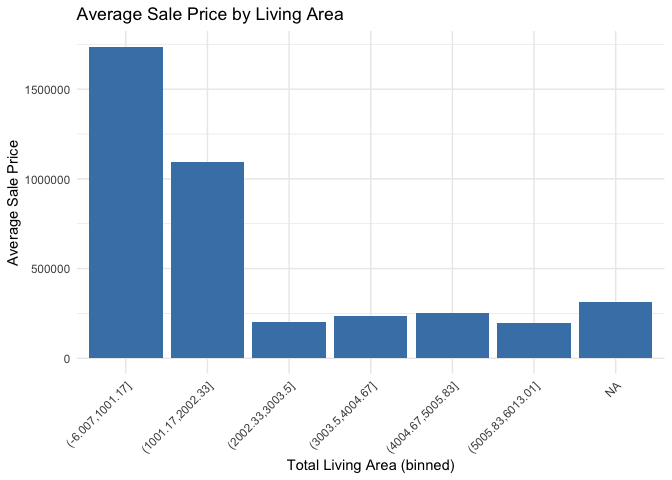
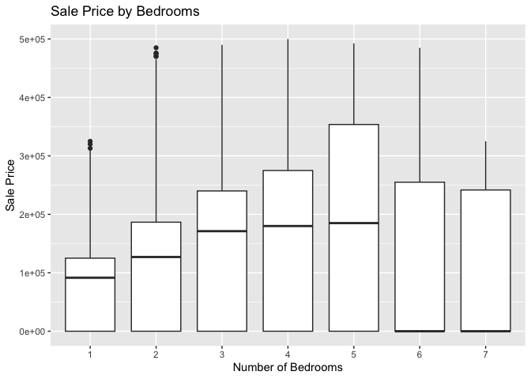

DS202 Lab2 Team3
================

<!-- README.md is generated from README.Rmd. Please edit the README.Rmd file -->

------------------------------------------------------------------------

# Lab report \#1

Follow the instructions posted at
<https://ds202-at-isu.github.io/labs.html> for the lab assignment. The
work is meant to be finished during the lab time, but you have time
until Monday evening to polish things.

Include your answers in this document (Rmd file). Make sure that it
knits properly (into the md file). Upload both the Rmd and the md file
to your repository.

All submissions to the github repo will be automatically uploaded for
grading once the due date is passed. Submit a link to your repository on
Canvas (only one submission per team) to signal to the instructors that
you are done with your submission.

------------------------------------------------------------------------

## Step 1 (inspect the first few lines of the data set: what variables are there? of what type are the variables? what does each variable mean? what do we expect their data range to be?)

``` r
# loading data (look at first few lines)
data(ames)

# inspecting data (variables, type, and meaning)
head(ames)
```

    ## # A tibble: 6 × 16
    ##   `Parcel ID` Address      Style Occupancy `Sale Date` `Sale Price` `Multi Sale`
    ##   <chr>       <chr>        <fct> <fct>     <date>             <dbl> <chr>       
    ## 1 0903202160  1024 RIDGEW… 1 1/… Single-F… 2022-08-12        181900 <NA>        
    ## 2 0907428215  4503 TWAIN … 1 St… Condomin… 2022-08-04        127100 <NA>        
    ## 3 0909428070  2030 MCCART… 1 St… Single-F… 2022-08-15             0 <NA>        
    ## 4 0923203160  3404 EMERAL… 1 St… Townhouse 2022-08-09        245000 <NA>        
    ## 5 0520440010  4507 EVERES… <NA>  <NA>      2022-08-03        449664 <NA>        
    ## 6 0907275030  4512 HEMING… 2 St… Single-F… 2022-08-16        368000 <NA>        
    ## # ℹ 9 more variables: YearBuilt <dbl>, Acres <dbl>,
    ## #   `TotalLivingArea (sf)` <dbl>, Bedrooms <dbl>,
    ## #   `FinishedBsmtArea (sf)` <dbl>, `LotArea(sf)` <dbl>, AC <chr>,
    ## #   FirePlace <chr>, Neighborhood <fct>

``` r
str(ames)
```

    ## tibble [6,935 × 16] (S3: tbl_df/tbl/data.frame)
    ##  $ Parcel ID            : chr [1:6935] "0903202160" "0907428215" "0909428070" "0923203160" ...
    ##  $ Address              : chr [1:6935] "1024 RIDGEWOOD AVE, AMES" "4503 TWAIN CIR UNIT 105, AMES" "2030 MCCARTHY RD, AMES" "3404 EMERALD DR, AMES" ...
    ##  $ Style                : Factor w/ 12 levels "1 1/2 Story Brick",..: 2 5 5 5 NA 9 5 5 5 5 ...
    ##  $ Occupancy            : Factor w/ 5 levels "Condominium",..: 2 1 2 3 NA 2 2 1 2 2 ...
    ##  $ Sale Date            : Date[1:6935], format: "2022-08-12" "2022-08-04" ...
    ##  $ Sale Price           : num [1:6935] 181900 127100 0 245000 449664 ...
    ##  $ Multi Sale           : chr [1:6935] NA NA NA NA ...
    ##  $ YearBuilt            : num [1:6935] 1940 2006 1951 1997 NA ...
    ##  $ Acres                : num [1:6935] 0.109 0.027 0.321 0.103 0.287 0.494 0.172 0.023 0.285 0.172 ...
    ##  $ TotalLivingArea (sf) : num [1:6935] 1030 771 1456 1289 NA ...
    ##  $ Bedrooms             : num [1:6935] 2 1 3 4 NA 4 5 1 3 4 ...
    ##  $ FinishedBsmtArea (sf): num [1:6935] NA NA 1261 890 NA ...
    ##  $ LotArea(sf)          : num [1:6935] 4740 1181 14000 4500 12493 ...
    ##  $ AC                   : chr [1:6935] "Yes" "Yes" "Yes" "Yes" ...
    ##  $ FirePlace            : chr [1:6935] "Yes" "No" "No" "No" ...
    ##  $ Neighborhood         : Factor w/ 42 levels "(0) None","(13) Apts: Campus",..: 15 40 19 18 6 24 14 40 13 23 ...

``` r
names(ames)
```

    ##  [1] "Parcel ID"             "Address"               "Style"                
    ##  [4] "Occupancy"             "Sale Date"             "Sale Price"           
    ##  [7] "Multi Sale"            "YearBuilt"             "Acres"                
    ## [10] "TotalLivingArea (sf)"  "Bedrooms"              "FinishedBsmtArea (sf)"
    ## [13] "LotArea(sf)"           "AC"                    "FirePlace"            
    ## [16] "Neighborhood"

**Answer:** As a team, we found that there are 16 variables in total.
“Parcel ID”, “Address”, “Multi Sale”, “AC”, and “FirePlace” are chr
variables. “Style”, “Occupancy”, and “Neighborhood” are fctr variables.
“Sale Price”, YearBuilt”, “Acres”, “TotalLivingArea (sf)”, “Bedrooms”,
“FinishedBsmtArea (sf)”, and LotArea(sf) are dbl variables. Lastly,
“Sale Date” is a date variable. Most of these variables are
self-explanatory based on their names. More in specific, some variables
are numeric (Sale Price and LotArea) and some variables are categorical
(Occupancy ,Neighborhood). Sale Price represents the selling price of
the house.

------------------------------------------------------------------------

## Step 2 (is there a variable of special interest or focus? Let’s call it the “main variable”)

``` r
# Finding Sales Price
summary(ames$`Sale Price`)
```

    ##     Min.  1st Qu.   Median     Mean  3rd Qu.     Max. 
    ##        0        0   170900  1017479   280000 20500000

``` r
# Range of Ames Sales Price
range(ames$`Sale Price`, na.rm = TRUE)
```

    ## [1]        0 20500000

**Answer:** As a team, we found that the main variable of interest is
Sale Price, which represents the final selling price of houses in Ames.
This variable helps us understand how different housing features like
size, bedrooms, neighborhood, and year built may affect the price of a
home.

------------------------------------------------------------------------

## Step 3 (start the exploration with the main variable: what is the range of this variable? draw a histogram for a numeric variable or a bar chart, if the variable is categorical. what is the general pattern? is there anything odd?)

``` r
# checked summary and range above
summary(ames$`Sale Price`)
```

    ##     Min.  1st Qu.   Median     Mean  3rd Qu.     Max. 
    ##        0        0   170900  1017479   280000 20500000

``` r
range(ames$`Sale Price`)
```

    ## [1]        0 20500000

``` r
# Sale Price clean the data to make it as visually clear
ames_sale_price <- ames %>%
  filter(`Sale Price` > 0, `Sale Price` < 500000)

# creating histogram
ggplot(ames_sale_price, aes(x = `Sale Price`)) +
  geom_histogram(bins = 25) +
  labs(title = "Distribution of Sale Prices (under $500,000)", x = "Sale Price", y = "Count")
```

<!-- -->

**Answer:** As a team, we found that the main variable is Sale Price. By
looking at the summary, the range of Sale Price is from 0 to 20,500,000.
The histogram above shows that the distribution of Sale Price for houses
under 500,000 (cleaning). More in specific, most houses are sold between
100,000 and 300,000 indicating that the concentration. We are able to
know that the histogram of the distribution is right-skewed. This means
that most houses are tend to sold at lower price with smaller number of
houses have higher prices. One unusual point is that few houses have
large Sale Price which makes us to interpret difficulty. Since we
cleaned the data set in order to have visually clear output, oddity
looks okay.

------------------------------------------------------------------------

## Step 4 (pick a variable that might be related to the main variable. what is the range of that variable? plot. describe the pattern. what is the relationship to the main variable? plot a scatterplot, boxplot or facetted barcharts dependening on the types of variables involved. Describe overall pattern, does this variable describe any oddities discovered in 3? Identify/follow-up on any oddities.)

**Tyler’s work:**

``` r
#my variable is TotalLivingArea (sf)

range(ames$`TotalLivingArea (sf)`, na.rm = TRUE)
```

    ## [1]    0 6007

``` r
# ^this^ function shows the range is 0-6007

#bar graph with the total living area binned
library(dplyr) 
library(ggplot2) 
ames %>% 
  mutate( LivingAreaBin = cut(`TotalLivingArea (sf)`, breaks = 6, dig.lab = 6) 
          ) %>% 
  group_by(LivingAreaBin) %>% 
  summarise(AvgSalePrice = mean(`Sale Price`, na.rm = TRUE)) %>% 
  ggplot(aes(x = LivingAreaBin, y = AvgSalePrice)) + geom_col(fill = "steelblue") + labs( title = "Average Sale Price by Living Area", x = "Total Living Area (binned)", y = "Average Sale Price" ) + theme_minimal() + theme(axis.text.x = element_text(angle = 45, hjust = 1))
```

<!-- -->

Explanation: From this bar plot, we can see that the lower total living
area houses tend to have a higher average sale price. I find it odd that
the higher living area houses are cheaper, as you would think that the
bigger houses would be more expensive.

**Jacob’s work:**

``` r
# Bedrooms (clean the data to make it as visually clear)
clean_data <- ames %>%
  filter(Bedrooms > 0, Bedrooms < 8, `Sale Price` < 500000)

# using ggplot to create plot
ggplot(clean_data, aes(x = factor(Bedrooms), y = `Sale Price`)) +
  geom_boxplot() +
  labs(title = "Sale Price by Bedrooms", x = "Number of Bedrooms", y = "Sale Price")
```

<!-- -->

Explanation: I chose Bedrooms to investigate the relationship between
Bedrooms and Sale Price. I cleaned the data in order to create visually
clear plot. The range of Bedrooms in the cleaned data is from 1 to 7. By
looking at the plot, houses with more bedrooms tend to have higher Sale
Price. More in specific, houses with 3-5 bedrooms have higher mean
compare to houses with 1-2 bedrooms. There is a wide range of prices
within each bedroom group which suggests that Bedrooms may influence
Sale Price, and other factors may also influence the Sale Price.
However, there are some unusual results that some houses with fewer
bedrooms still have relatively high prices. In these cases, we might
need further analysis with different variables such as Address, Style,
or Occupancy.

**Favour’s work:**

``` r
# Favour's code here!
```

Explanation:

**Kavya’s work:**

``` r
# Kavya's code here!
```

Explanation:
